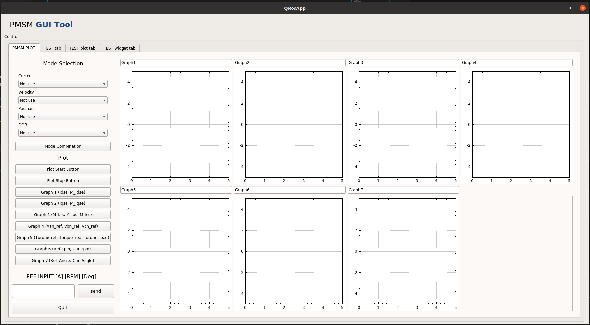
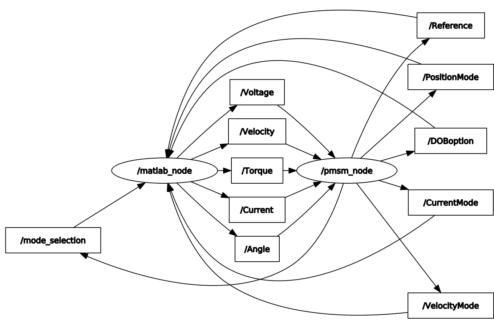

# 2021 PBL Robot Control

## 0. Purpose of Development

[Outline]


  1. MATLAB-based PMSM Driver Design for Neuromeka-CORE simulation.
  2. Connect Matlab to ROS2.
  3. GUI production using ROS2.

## 1. MATLAB-based PMSM Driver Design for Neuromeka-CORE simulation.
### 1.1 Development Environment
  - Window11 wls2.
  - Ubuntu 18.04, ROS2 dashing.
  - MATLAB R2021b.
  
### 1.2 Prerequisite
  - install add-on (ROS Toolbox v1.2).
  - install add-on (Robust Control Toolbox).
  - install add-on (Control System Toolbox).
  - install add-on (Signal Processing Toolbox).
  - install Multiparametric toolbox (MPT), using (install_mpt3.m) file.

### 1.3 MATLAB-based PMSM Driver Version list
  - Version_0 : Current & Velocity Control.
  - Version_1 : Select [Current / Velosity / Position] Control Mode. (Same control frequency)
  - Version_2 : Select [Current / Velosity / Position] Control Mode. (Different control frequency)
  - Version_3 : Model Predictive Control(MPC).
  - Version_4 : Multi-Parametric Toolbox(MPT) based MPC.
  - Version_5 : Disturbance Observer(DOB).
  - Version_6 : H-infinity Control. 
  - Version_alpha : Integrated Controller.
  - Version_beta : The latest version.

### 1.4 Overall Structure

[Block Diagram]


- You can use a Combination of Control Modes.
  - 0: Not use      1: Current(PI)   2: Current(MPC)      
  - 0: Not use      1: Velocity(PI)  2: Velocity(MPC) 3: Velocity(H-inf)    
  - 0: Not use      1: Position(PI)      
  - 0: Not use      1: Current(PI+DOB)

### 1.5 Future Work
  - Controller Maintenance.
  - Add More Control Modes.
  - ...

## 2. MATLAB to ROS2 & Design GUI
  - This meta-packages is for bridging between matlab and local ros2 dashing to control PMSM Driver by using gui interface.
  
### 2.1 Prerequisite
  - Ubuntu 64-bit 18.04 && ROS2 Dashing : Follow [ROS Installation](https://docs.ros.org/en/dashing/Installation.html)
  - QT : Follow [QT Installation](https://ros-qtc-plugin.readthedocs.io/en/latest/_source/How-to-Install-Users.html)
  - Docker : Follow [Docker Installation](https://docs.docker.com/engine/install/ubuntu/)

### 2.2 Package Structure
  - ROS2 PMSM Studio
    ```
    pmsm_studio
    ├── CMakeLists.txt
    ├── include
    │   ├── main_window.hpp
    │   ├── qcustomplot.h
    │   └── qnode.hpp
    ├── package.xml
    ├── src
    │   ├── main.cpp
    │   ├── main_window.cpp
    │   ├── plot_window.cpp
    │   ├── qcustomplot.cpp
    │   └── qnode.cpp
    └── ui
        ├── main_window.ui
        └── plot.ui

    3 directories, 12 files
    ```
  - ROS2 MATLAB Node
    ```
    matlab_node
    ├── BOUND_PI.m
    ├── callback_CurrentMode.m
    ├── callback_DOBoption.m
    ├── callback_ModeSelection.m
    ├── callback_PositionMode.m
    ├── callback_Reference.m
    ├── callback_VelocityMode.m
    ├── mpcgain.m
    └── Test_Code_Final.m

    0 directories, 9 files
    ```
    
### 2.3 Environment Setting
  - pmsm_studio
    ```
    $ cd ~/PBL_RobotControl/matlab2ros/env_settings
    $ ./build.sh
    $ ./docker_run.sh
    $ cd ~/colcon_ws/src
    $ git clone https://github.com/BreadOak/PBL_RobotControl.git 
    ```
  - matlab_node
    ```
    Open MATLAB
    move to ~/PBL_RobotControl/Matlab_PMSM_Drive/Test_Code
    Run install_mpt3.m
    ```
    
### 2.4 UI Design


### 2.5 How to Use
    ```
    ## in docker workspace
    $ docker exec -it gpu_ros2 /bin/bash
    $ cm
    $ sb
    $ ros2 run pmsm_studio pmsm_studio

    # matlab workspace
    Run ~/PBL_RobotControl/matlab2ros/matlab_node/Test_Code_Final.m
    ```

### 2.6 ROS2 Connections
<center></center>

### 2.7 Results
