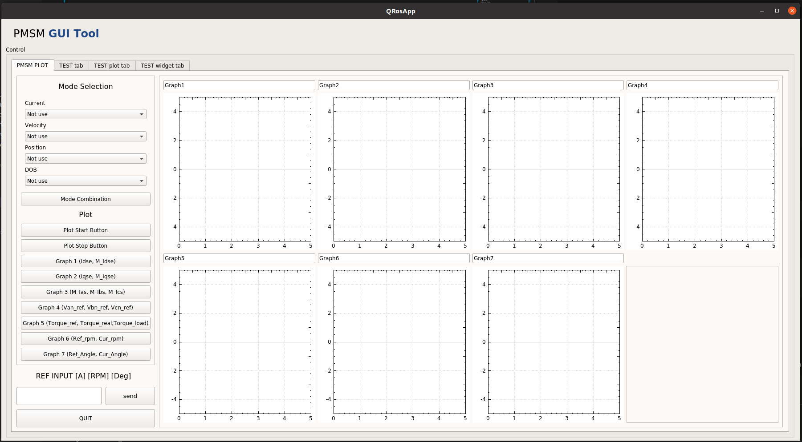

# MATLAB to ROS2
This meta-packages is for bridging between matlab and local ros2 dashing to control PMSM Driver by using gui interface.
## 1.Prerequisite
### 1.1 Ubuntu and ROS2
Ubuntu 64-bit 18.04 && ROS2 Dashing. [ROS Installation](https://docs.ros.org/en/dashing/Installation.html)
### 1.2 QT
Follow [QT Installation](https://ros-qtc-plugin.readthedocs.io/en/latest/_source/How-to-Install-Users.html)
### 1.3 MATLAB
ROS Toolbox v1.2
### 1.4 Docker
Follow [Docker Installation](https://docs.docker.com/engine/install/ubuntu/)

## 2. Package Structure
### 2.1 ROS2 PMSM Studio
```
pmsm_studio
├── CMakeLists.txt
├── include
│   ├── main_window.hpp
│   ├── qcustomplot.h
│   └── qnode.hpp
├── package.xml
├── src
│   ├── main.cpp
│   ├── main_window.cpp
│   ├── plot_window.cpp
│   ├── qcustomplot.cpp
│   └── qnode.cpp
└── ui
    ├── main_window.ui
    └── plot.ui

3 directories, 12 files
```
### 2.2 ROS2 MATLAB Node
```
matlab_node
├── BOUND_PI.m
├── callback_CurrentMode.m
├── callback_DOBoption.m
├── callback_ModeSelection.m
├── callback_PositionMode.m
├── callback_Reference.m
├── callback_VelocityMode.m
├── mpcgain.m
└── Test_Code_Final.m

0 directories, 9 files
```

## 3. Environment Setting
### 3.1 pmsm_studio
```
$ cd ~/PBL_RobotControl/matlab2ros/env_settings
$ ./build.sh
$ ./docker_run.sh
$ cd ~/colcon_ws/src
$ git clone https://github.com/BreadOak/PBL_RobotControl.git 
```
### 3.2 matlab_node
```
Open MATLAB
move to ~/PBL_RobotControl/Matlab_PMSM_Drive/Test_Code
Run install_mpt3.m
```
## 4. UI Design

## 5. How to Use
```
## in docker workspace
$ docker exec -it gpu_ros2 /bin/bash
$ cm
$ sb
$ ros2 run pmsm_studio pmsm_studio

# matlab workspace
Run ~/PBL_RobotControl/matlab2ros/matlab_node/Test_Code_Final.m
```
## 6. ROS2 Connections
<center></center>

## 7. Results